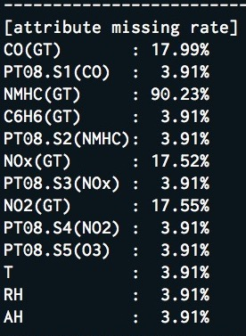
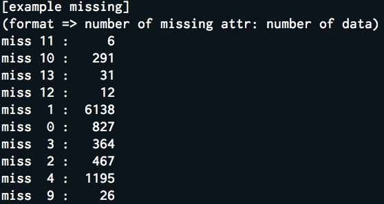
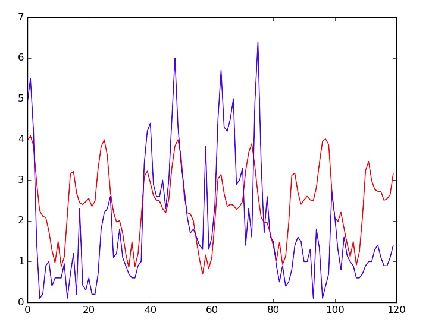
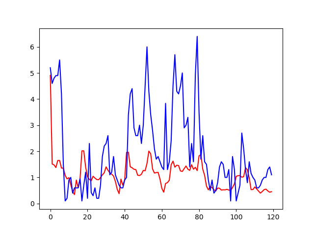

# KKBOX UCI AQ Screening Question

## Get Dataset & Installation
  ```
  $ mkdir result && mkdir res && cd res
  $ wget https://archive.ics.uci.edu/ml/machine-learning-databases/00360/AirQualityUCI.zip
  $ unzip AirQualityUCI.zip
  $ cd .. && python3 -m venv [virtualenv_path]
  $ pip install -r ./requirements.txt
  ```

## Data Preprocessing (preprocessing.py)
First, I check the missing rate for each attribute. Among them, the missing rate of NMHC is as high as 90%. If I keep this attribute, it will cause too many non-real value (I will need to fill missing value artificially), so this property will be removed first.

For the missing vaule, I divide into two conditions:
  
  * If there is no other missing value around the missing value's fisrt five and last five, e.g. `0.2, 0.3, 0.4, 0.5, 0.2, -200, 0.4, 0.2, 0.1, 0.4, 0.5`, I use cubic interpolation to fill the missing value. Because this dataset contains time series characteristics, so calculating interpolation from the adjacent value is suitable for the dataset. I can get a value which is close to truth value or the trend.
  
  * If the above condition is not met, it means that there are many missing value locating nearby or connecting together. I will calculate the median from the same timing. For example, if there is a missing value appear at `2017/3/11 Monday 11:00`, I will calculate the median from all the value at `Monday 11:00`. This processing's purpose is to get a value which is the most general. General means the value will not be too high or too low to seriously affect the forcast.



At first, I want to remove the example in dataset which number of missing value is too many. But after removing, it is really hard for me to generate the training data beacause I need the data's date to be consecutive. Therefore, I don't remove any example from the origin dataset.



## Feature Set (dataset.py)
I use CO(GT), PT08.S1(CO), C6H6(GT), PT08.S2(NMHC), NOx(GT), PT08.S3(NOx), NO2(GT), PT08.S4(NO2), PT08.S5(O3), T, RH, AH as features. I convert Date and Time into `Weekday` and `Hour`. Finally, I have `14` features.

In this dataset, I don't perform feature selection because most feature selection methods are not suitable for time series data. 

Before prediction, I scale every attribute's value to 0~1 to prevent the bias caused by different scale.

## Prediction

* About selecting model, there are two candidates for me to choose. RNN (recurrent neural network) and SVM (support vector machine). Eventually I select RNN. Although I am familiar with SVM than RNN, I think RNN is more suitable than SVM on time series data becauce RNN was originally used to process the sequential pattern data. 

* At first, I thought of two methods for building this model. One of the two methods is using past 30 days (from X1 to X30) data to train and output the next 30 days's CO concentration in once output (y). Every time step Xi is 14 dimensions (all features). In this model, I want to output all prediction in once, so I input many days data as training data in order to make model learn the trend. I use `mean square error (mse)` as lossing function to train my RNN, and also use mse to evaluate my model.

	* Run: `$ python lstm_rnn_pred_next_5_days_co.py`

	
	
	* The following image is the result of this model (horizontal axis -> time steps, vertical axis -> CO concentration, blue line -> true value, red line -> prediction value). I think this model just learn some pattern and trend of one day. In this case, I think that outputting so many days in once isn't a good choice because the model can't learn the long term pattern.
	
	

* Owing to the above result, I build another model which is using past 10 days (from X1 to X10) data to train and output the next 1 days' CO concentration in once output (y). If I want to predict the next 2 days, I will fisrt predict the next 1 day's CO concentration value, and use this value as training data to predict the second day, and so on. I shrinked the training data to 10 days because of that I hope my model can excatly learn something pattern during a short term (if I use 30 days data as training data, I will need more neurons to strength my model, but too many neurons may need too much time to train). Every time step Xi is 3 dimensions (3 features -> CO concentration, weekday and hour).

	* Run: `$ python lstm_rnn_pred_next_1_days_co.py`

	* The following image is the result of this model (horizontal axis - time steps, vertical axis - CO concentration, blue line - true value, red line - prediction value). This time, the model still can not learn a long term pattern, but there are more detailed curve in one day.

	


## More things I think I can perform is ...

* Build a more complicated model (the current model is really simple)

* I should try other training technique for deep neural network, e.g. drop out layer, relu activation function ...

* Using the trained model to relabel the training data, and compare this with the ground truth training data. If these two curve's mse is still huge, it means that the RNN model doesn't learn things from training data, and then the method for building model must need to be changed or fixed.

